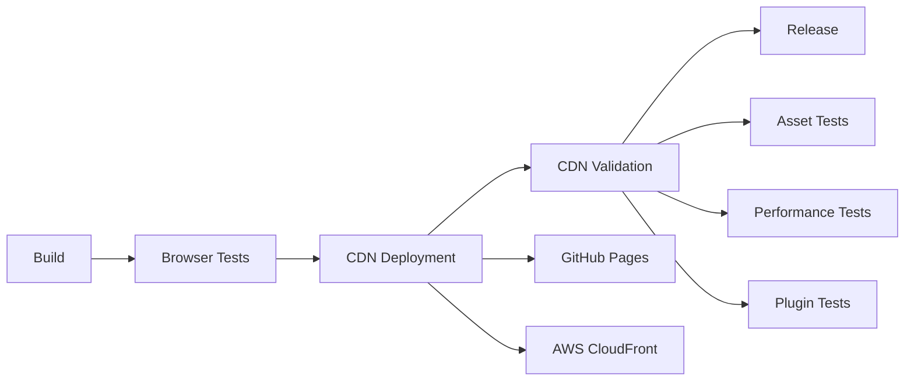

# CI Integration Summary: CDN Deployment

## ✅ Updated GitHub Actions CI Workflow

The main CI workflow (`ci.yml`) has been **successfully updated** to include comprehensive CDN deployment capabilities. Here's what was integrated:

### New CI Jobs Added

#### 1. `cdn-deployment` Job
- **Purpose**: Deploy DataPrism to CDN providers
- **Triggers**: Main branch pushes
- **Features**:
  - ✅ Primary deployment to GitHub Pages using our CDN system
  - ✅ Secondary deployment to AWS CloudFront (optional)
  - ✅ Plugin manifest generation
  - ✅ Performance testing
  - ✅ Deployment status reporting

#### 2. `cdn-validation` Job  
- **Purpose**: Validate CDN deployments post-deployment
- **Features**:
  - ✅ Comprehensive validation using our validation system
  - ✅ Plugin loading tests
  - ✅ Browser compatibility testing
  - ✅ Performance benchmarking
  - ✅ Detailed validation reporting

### Integration Points

#### Updated Build Job
- ✅ Now includes `npm run build:cdn` 
- ✅ CDN assets included in build artifacts
- ✅ Bundle size validation with `npm run size-check`

#### Updated Dependencies
- ✅ Release job now depends on CDN deployment
- ✅ Notification job includes CDN deployment status
- ✅ Proper job ordering ensures CDN deployment after successful builds

### Deployment Flow



### Key Features

#### 🚀 **Automated CDN Deployment**
- Deploys to GitHub Pages on every main branch push
- Uses our comprehensive CDN deployment system
- Includes plugin manifest generation
- Optional AWS CloudFront deployment

#### 🔍 **Comprehensive Validation**
- Asset integrity verification
- Performance benchmarking against targets
- Plugin system functionality testing
- Browser compatibility validation

#### 📊 **Rich Reporting**
- Deployment summary in GitHub Actions
- Performance metrics
- CDN URLs and status
- Validation results

### Environment Variables & Secrets

#### Required for GitHub Pages:
- `GITHUB_TOKEN` (automatically provided)

#### Optional for AWS CloudFront:
- `ENABLE_AWS_CDN` (repository variable)
- `AWS_ACCESS_KEY_ID` (secret)
- `AWS_SECRET_ACCESS_KEY` (secret)
- `CDN_BUCKET` (secret)
- `CLOUDFRONT_DISTRIBUTION_ID` (secret)
- `CLOUDFRONT_DOMAIN` (secret)

### Deployment Targets

#### ✅ **GitHub Pages** (Primary CDN)
- **URL Pattern**: `https://{owner}.github.io/{repo}`
- **Automatic**: Deployed on every main branch push
- **Features**: Full asset optimization, plugin support, validation

#### ⚙️ **AWS CloudFront** (Secondary CDN)
- **Conditional**: Only if `ENABLE_AWS_CDN=true`
- **Features**: S3 + CloudFront distribution, cache invalidation
- **Versioning**: Both versioned (`/v{sha}/`) and latest (`/latest/`) paths

### Performance Targets Validated

- ✅ **Core Bundle Load**: <5 seconds
- ✅ **Asset Accessibility**: 100% success rate
- ✅ **Plugin Loading**: Functional and validated
- ✅ **WASM Support**: Proper MIME types and loading

### Usage Examples

#### Manual Trigger
```bash
# Deploy via CLI (also works in CI)
npm run deploy:github-pages

# Validate deployment
npm run validate:cdn https://owner.github.io/repo
```

#### CI Behavior
- **Main Branch Push**: Automatic CDN deployment + validation
- **Pull Request**: Build validation only (no deployment)
- **Release Commit**: Full deployment + validation + release

### Monitoring & Alerts

#### ✅ **Success Reporting**
- Deployment URLs in job summary
- Performance metrics
- Asset counts and sizes
- Validation results

#### ❌ **Failure Handling**
- Slack notifications on failure
- Detailed error logs
- Non-blocking optional deployments
- Graceful degradation

## Summary

The CI pipeline now provides **production-ready CDN deployment** with:

1. **Automated Deployment**: Zero-config deployment to GitHub Pages
2. **Comprehensive Validation**: Performance, security, and functionality testing
3. **Multi-CDN Support**: GitHub Pages + optional AWS CloudFront
4. **Rich Reporting**: Detailed status and metrics in GitHub Actions
5. **Failure Handling**: Robust error handling and notifications

The integration maintains backward compatibility while adding powerful CDN capabilities that activate automatically when pushing to the main branch. The system is designed to be reliable, informative, and production-ready.

**Next Steps**: The CI is ready to deploy DataPrism to CDN on the next main branch push! 🚀