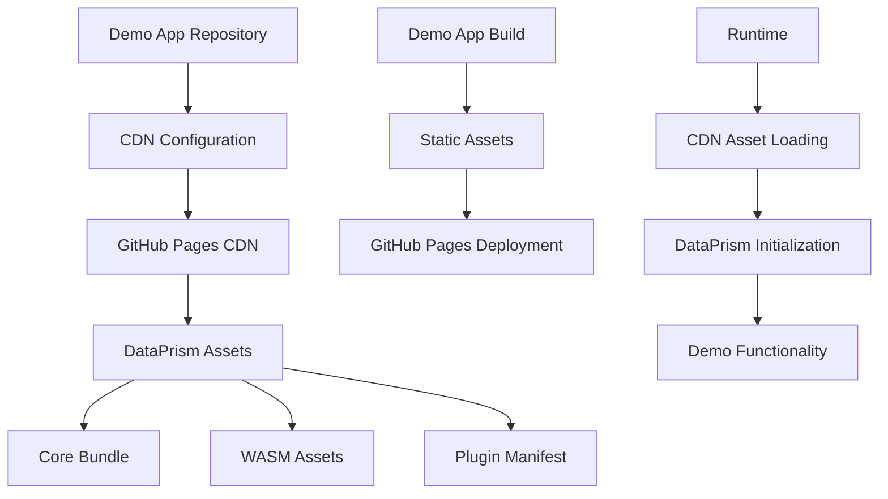

# Demo Analytics Decoupling - Product Requirements Prompt (PRP)

## Executive Summary

**Feature:** Decouple the demo-analytics application from the DataPrism monorepo into a standalone, independently deployable application.

**Primary Objectives:**
- Create a standalone demo-analytics repository that consumes DataPrism via CDN
- Eliminate all local package dependencies and monorepo coupling
- Establish independent CI/CD pipeline for demo app deployment
- Enable version-controlled CDN consumption with fallback strategies
- Demonstrate best practices for DataPrism integration via published CDN assets

**Success Criteria:**
- Demo app loads DataPrism from GitHub Pages CDN in <5 seconds
- Switching DataPrism versions requires only configuration changes
- Independent deployment completes in <10 minutes
- Zero local DataPrism package dependencies

**Architecture Layer Affected:** Orchestration and Plugin layers with new CDN integration patterns

## Context and Background

### Current State

The demo-analytics application is currently tightly coupled to the DataPrism monorepo:

**Current Dependencies:**
```typescript
// vite.config.ts - Local development aliases
resolve: {
  alias: {
    "@dataprism/core": resolve(__dirname, "../../packages/core/pkg"),
    "@dataprism/orchestration": resolve(__dirname, "../../packages/orchestration/src"),
    "@dataprism/plugins": resolve(__dirname, "../../packages/plugins/src"),
  },
}
```

**Monorepo Structure Issues:**
- Direct imports from local packages in `packages/`
- Build system depends on monorepo build pipeline
- Cannot be deployed independently
- No CDN consumption mechanism
- Tight coupling to internal development structure

### Current CDN Infrastructure

DataPrism already has a robust CDN deployment system:

**Available CDN Assets:**
- **Base URL:** `https://srnarasim.github.io/DataPrism/`
- **Core Bundle:** `dataprism.umd.js` (UMD format, 8.2KB)
- **ES Module:** `dataprism.min.js` (modern ES modules)
- **Asset Manifest:** `manifest.json` with integrity hashes
- **Plugin System:** Discoverable plugins with category organization
- **WASM Assets:** Optimized WebAssembly binaries

**CDN Features:**
- Subresource Integrity (SRI) support
- Multiple format support (UMD/ES modules)
- Automatic versioning and integrity hashes
- Plugin manifest with category-based discovery
- Performance monitoring and validation

### Why This Feature Is Needed

1. **Independent Deployment:** Demo app should be deployable without DataPrism platform changes
2. **Real-World Usage Pattern:** Demonstrates how external developers should integrate DataPrism
3. **Reduced Complexity:** Simplifies contribution and maintenance for demo-specific features
4. **Version Management:** Clear separation between platform and demo versioning
5. **Distribution Strategy:** Shows best practices for CDN consumption

## Technical Specifications

### Performance Targets

- **CDN Asset Loading:** <5 seconds on modern broadband
- **Initial Render:** <2 seconds after CDN assets loaded
- **Memory Usage:** <100MB for demo app overhead (excluding DataPrism)
- **Bundle Size:** <500KB for demo app code (excluding DataPrism CDN assets)

### Browser Compatibility

Must support same targets as DataPrism Core:
- Chrome 90+ (✅ Full support)
- Firefox 88+ (✅ Full support) 
- Safari 14+ (✅ Limited threading)
- Edge 90+ (✅ Full support)

### Security Requirements

- **HTTPS Only:** All CDN requests over HTTPS
- **Subresource Integrity:** SRI hashes for all DataPrism assets
- **Content Security Policy:** Strict CSP with CDN allowlist
- **CORS Compliance:** Proper cross-origin handling

### CDN Integration Architecture



## Implementation Plan

### Step 1: Environment Setup and Repository Creation

**1.1 Create New Repository**
```bash
# Create new repository structure
mkdir dataprism-demo-analytics
cd dataprism-demo-analytics

# Initialize with essential files
git init
echo "# DataPrism Demo Analytics" > README.md
echo "node_modules\n.env\ndist\n*.log" > .gitignore
```

**1.2 Package Configuration**
```json
{
  "name": "dataprism-demo-analytics",
  "version": "1.0.0",
  "type": "module",
  "private": true,
  "scripts": {
    "dev": "vite",
    "build": "tsc && vite build",
    "preview": "vite preview",
    "deploy": "npm run build && gh-pages -d dist",
    "test": "vitest",
    "lint": "eslint src --ext ts,tsx",
    "format": "prettier --write src"
  },
  "dependencies": {
    "react": "^18.2.0",
    "react-dom": "^18.2.0",
    "react-router-dom": "^6.15.0"
  },
  "devDependencies": {
    "@types/react": "^18.2.0",
    "@types/react-dom": "^18.2.0",
    "@vitejs/plugin-react": "^4.0.0",
    "typescript": "^5.2.0",
    "vite": "^5.0.0",
    "gh-pages": "^6.0.0"
  }
}
```

### Step 2: CDN Integration Layer

**2.1 CDN Configuration System**
```typescript
// src/config/cdn.ts
export interface CDNConfig {
  baseUrl: string;
  version: string;
  integrity?: {
    core?: string;
    orchestration?: string;
    plugins?: Record<string, string>;
  };
  fallback?: {
    enabled: boolean;
    retries: number;
    timeout: number;
  };
}

export const defaultCDNConfig: CDNConfig = {
  baseUrl: 'https://srnarasim.github.io/DataPrism',
  version: 'latest',
  fallback: {
    enabled: true,
    retries: 3,
    timeout: 10000
  }
};

// Environment-based configuration
export const getCDNConfig = (): CDNConfig => {
  return {
    ...defaultCDNConfig,
    baseUrl: import.meta.env.VITE_DATAPRISM_CDN_URL || defaultCDNConfig.baseUrl,
    version: import.meta.env.VITE_DATAPRISM_VERSION || defaultCDNConfig.version,
  };
};
```

**2.2 CDN Asset Loader**
```typescript
// src/utils/cdnLoader.ts
import { CDNConfig } from '../config/cdn';

export class CDNAssetLoader {
  private config: CDNConfig;
  private loadedAssets = new Set<string>();

  constructor(config: CDNConfig) {
    this.config = config;
  }

  async loadCoreBundle(): Promise<typeof DataPrism> {
    const coreUrl = `${this.config.baseUrl}/dataprism.umd.js`;
    
    try {
      await this.loadScript(coreUrl, this.config.integrity?.core);
      
      // Wait for global DataPrism to be available
      return await this.waitForGlobal('DataPrism', this.config.fallback?.timeout || 10000);
    } catch (error) {
      if (this.config.fallback?.enabled) {
        return await this.loadFallback();
      }
      throw new Error(`Failed to load DataPrism from CDN: ${error.message}`);
    }
  }

  private async loadScript(url: string, integrity?: string): Promise<void> {
    return new Promise((resolve, reject) => {
      if (this.loadedAssets.has(url)) {
        resolve();
        return;
      }

      const script = document.createElement('script');
      script.src = url;
      script.crossOrigin = 'anonymous';
      
      if (integrity) {
        script.integrity = integrity;
      }

      script.onload = () => {
        this.loadedAssets.add(url);
        resolve();
      };
      
      script.onerror = () => {
        reject(new Error(`Failed to load script: ${url}`));
      };

      document.head.appendChild(script);
    });
  }

  private async waitForGlobal(name: string, timeout: number): Promise<any> {
    const start = Date.now();
    
    return new Promise((resolve, reject) => {
      const check = () => {
        if ((window as any)[name]) {
          resolve((window as any)[name]);
          return;
        }
        
        if (Date.now() - start > timeout) {
          reject(new Error(`Timeout waiting for global ${name}`));
          return;
        }
        
        setTimeout(check, 100);
      };
      
      check();
    });
  }

  private async loadFallback(): Promise<typeof DataPrism> {
    // Implement fallback strategy (e.g., different CDN, local assets)
    throw new Error('CDN fallback not implemented');
  }
}
```

### Step 3: DataPrism Integration Context

**3.1 CDN-Based DataPrism Context**
```typescript
// src/contexts/DataPrismContext.tsx
import React, { createContext, useContext, useEffect, useState } from 'react';
import { CDNAssetLoader } from '../utils/cdnLoader';
import { getCDNConfig } from '../config/cdn';

interface DataPrismContextValue {
  engine: any | null;
  isInitialized: boolean;
  isInitializing: boolean;
  initializationError: Error | null;
  cdnStatus: 'loading' | 'loaded' | 'error';
  
  // Core operations
  query: (sql: string) => Promise<any>;
  loadData: (data: any[], tableName?: string) => Promise<void>;
  
  // Utility functions
  retry: () => Promise<void>;
}

const DataPrismContext = createContext<DataPrismContextValue | null>(null);

export const DataPrismProvider: React.FC<{ children: React.ReactNode }> = ({ 
  children 
}) => {
  const [engine, setEngine] = useState<any>(null);
  const [isInitialized, setIsInitialized] = useState(false);
  const [isInitializing, setIsInitializing] = useState(false);
  const [initializationError, setInitializationError] = useState<Error | null>(null);
  const [cdnStatus, setCdnStatus] = useState<'loading' | 'loaded' | 'error'>('loading');

  const initializeDataPrism = async () => {
    if (isInitializing || isInitialized) return;
    
    setIsInitializing(true);
    setInitializationError(null);
    setCdnStatus('loading');

    try {
      const cdnConfig = getCDNConfig();
      const loader = new CDNAssetLoader(cdnConfig);
      
      // Load DataPrism from CDN
      const DataPrism = await loader.loadCoreBundle();
      setCdnStatus('loaded');
      
      // Initialize engine
      const engineInstance = new DataPrism.DataPrismEngine({
        wasmUrl: `${cdnConfig.baseUrl}/assets/dataprism-core.wasm`,
        enableOptimizations: true,
        debug: false
      });
      
      await engineInstance.initialize();
      
      setEngine(engineInstance);
      setIsInitialized(true);
    } catch (error) {
      setInitializationError(error as Error);
      setCdnStatus('error');
      console.error('Failed to initialize DataPrism:', error);
    } finally {
      setIsInitializing(false);
    }
  };

  useEffect(() => {
    initializeDataPrism();
  }, []);

  const query = async (sql: string) => {
    if (!engine) {
      throw new Error('DataPrism engine not initialized');
    }
    return await engine.query(sql);
  };

  const loadData = async (data: any[], tableName = 'data') => {
    if (!engine) {
      throw new Error('DataPrism engine not initialized');
    }
    return await engine.loadData(data, tableName);
  };

  const retry = async () => {
    setIsInitialized(false);
    setEngine(null);
    await initializeDataPrism();
  };

  const value: DataPrismContextValue = {
    engine,
    isInitialized,
    isInitializing,
    initializationError,
    cdnStatus,
    query,
    loadData,
    retry
  };

  return (
    <DataPrismContext.Provider value={value}>
      {children}
    </DataPrismContext.Provider>
  );
};

export const useDataPrism = () => {
  const context = useContext(DataPrismContext);
  if (!context) {
    throw new Error('useDataPrism must be used within a DataPrismProvider');
  }
  return context;
};
```

### Step 4: Build System Configuration

**4.1 Vite Configuration**
```typescript
// vite.config.ts
import { defineConfig } from 'vite';
import react from '@vitejs/plugin-react';
import { resolve } from 'path';

export default defineConfig({
  plugins: [react()],
  
  // Remove DataPrism package aliases - use CDN instead
  resolve: {
    alias: {
      '@': resolve(__dirname, './src'),
    },
  },

  build: {
    outDir: 'dist',
    sourcemap: true,
    rollupOptions: {
      output: {
        manualChunks: {
          vendor: ['react', 'react-dom', 'react-router-dom'],
        },
      },
    },
  },

  // Development server configuration
  server: {
    port: 3000,
    headers: {
      'Cross-Origin-Embedder-Policy': 'require-corp',
      'Cross-Origin-Opener-Policy': 'same-origin',
    },
  },

  // Preview server configuration (matches production)
  preview: {
    port: 3000,
    headers: {
      'Cross-Origin-Embedder-Policy': 'require-corp',
      'Cross-Origin-Opener-Policy': 'same-origin',
    },
  },

  define: {
    __APP_VERSION__: JSON.stringify(process.env.npm_package_version),
  },
});
```

**4.2 Environment Configuration**
```bash
# .env.example
VITE_DATAPRISM_CDN_URL=https://srnarasim.github.io/DataPrism
VITE_DATAPRISM_VERSION=latest
VITE_ENABLE_ANALYTICS=false
VITE_DEBUG_MODE=false
```

### Step 5: Component Migration and Updates

**5.1 CDN Status Component**
```typescript
// src/components/CDNStatus.tsx
import React from 'react';
import { useDataPrism } from '../contexts/DataPrismContext';

export const CDNStatus: React.FC = () => {
  const { cdnStatus, isInitialized, initializationError, retry } = useDataPrism();

  const getStatusColor = () => {
    switch (cdnStatus) {
      case 'loading': return 'text-blue-600';
      case 'loaded': return 'text-green-600';
      case 'error': return 'text-red-600';
      default: return 'text-gray-600';
    }
  };

  const getStatusIcon = () => {
    switch (cdnStatus) {
      case 'loading': return '🔄';
      case 'loaded': return '✅';
      case 'error': return '❌';
      default: return '⏳';
    }
  };

  return (
    <div className="flex items-center space-x-2 p-2 border rounded">
      <span className="text-lg">{getStatusIcon()}</span>
      <div className="flex flex-col">
        <span className={`font-medium ${getStatusColor()}`}>
          CDN Status: {cdnStatus}
        </span>
        {isInitialized && (
          <span className="text-sm text-green-600">DataPrism Ready</span>
        )}
        {initializationError && (
          <span className="text-sm text-red-600">
            Error: {initializationError.message}
          </span>
        )}
      </div>
      {initializationError && (
        <button
          onClick={retry}
          className="px-3 py-1 text-sm bg-blue-500 text-white rounded hover:bg-blue-600"
        >
          Retry
        </button>
      )}
    </div>
  );
};
```

**5.2 Updated Home Page**
```typescript
// src/pages/HomePage.tsx
import React from 'react';
import { useDataPrism } from '../contexts/DataPrismContext';
import { CDNStatus } from '../components/CDNStatus';

export const HomePage: React.FC = () => {
  const { isInitialized, engine } = useDataPrism();

  return (
    <div className="max-w-4xl mx-auto p-6">
      <h1 className="text-4xl font-bold text-gray-900 mb-8">
        DataPrism Demo Analytics
      </h1>
      
      <div className="mb-6">
        <CDNStatus />
      </div>

      {isInitialized ? (
        <div className="grid grid-cols-1 md:grid-cols-2 gap-6">
          <div className="bg-white p-6 rounded-lg shadow">
            <h2 className="text-2xl font-semibold mb-4">Data Explorer</h2>
            <p className="text-gray-600 mb-4">
              Import and explore datasets with DataPrism's powerful analytics engine.
            </p>
            <a
              href="/data-explorer"
              className="inline-block px-4 py-2 bg-blue-500 text-white rounded hover:bg-blue-600"
            >
              Explore Data
            </a>
          </div>

          <div className="bg-white p-6 rounded-lg shadow">
            <h2 className="text-2xl font-semibold mb-4">Visualization Lab</h2>
            <p className="text-gray-600 mb-4">
              Create interactive charts and visualizations from your data.
            </p>
            <a
              href="/visualization"
              className="inline-block px-4 py-2 bg-green-500 text-white rounded hover:bg-green-600"
            >
              Create Charts
            </a>
          </div>
        </div>
      ) : (
        <div className="text-center py-12">
          <div className="animate-spin rounded-full h-12 w-12 border-b-2 border-blue-500 mx-auto mb-4"></div>
          <p className="text-gray-600">Loading DataPrism from CDN...</p>
        </div>
      )}

      <div className="mt-12 bg-gray-50 p-6 rounded-lg">
        <h3 className="text-xl font-semibold mb-4">About This Demo</h3>
        <p className="text-gray-700 mb-4">
          This demo application showcases DataPrism's capabilities by loading the engine 
          directly from CDN. It demonstrates best practices for integrating DataPrism 
          into external applications without requiring local package dependencies.
        </p>
        <div className="grid grid-cols-1 md:grid-cols-3 gap-4 text-sm">
          <div>
            <strong>CDN Source:</strong>
            <br />
            GitHub Pages
          </div>
          <div>
            <strong>Bundle Format:</strong>
            <br />
            UMD + ES Modules
          </div>
          <div>
            <strong>Asset Integrity:</strong>
            <br />
            SHA-384 Verified
          </div>
        </div>
      </div>
    </div>
  );
};
```

### Step 6: CI/CD Pipeline Setup

**6.1 GitHub Actions Workflow**
```yaml
# .github/workflows/deploy.yml
name: Deploy Demo Analytics

on:
  push:
    branches: [ main ]
  pull_request:
    branches: [ main ]

jobs:
  test:
    runs-on: ubuntu-latest
    steps:
      - name: Checkout
        uses: actions/checkout@v4

      - name: Setup Node.js
        uses: actions/setup-node@v4
        with:
          node-version: '18'
          cache: 'npm'

      - name: Install dependencies
        run: npm ci

      - name: Run tests
        run: npm test

      - name: Run lint
        run: npm run lint

      - name: Type check
        run: npx tsc --noEmit

  build:
    needs: test
    runs-on: ubuntu-latest
    steps:
      - name: Checkout
        uses: actions/checkout@v4

      - name: Setup Node.js
        uses: actions/setup-node@v4
        with:
          node-version: '18'
          cache: 'npm'

      - name: Install dependencies
        run: npm ci

      - name: Build application
        run: npm run build
        env:
          VITE_DATAPRISM_CDN_URL: https://srnarasim.github.io/DataPrism
          VITE_DATAPRISM_VERSION: latest

      - name: Upload build artifacts
        uses: actions/upload-artifact@v4
        with:
          name: dist
          path: dist/

  deploy:
    needs: build
    runs-on: ubuntu-latest
    if: github.ref == 'refs/heads/main'
    permissions:
      contents: write
      pages: write
      id-token: write
    steps:
      - name: Checkout
        uses: actions/checkout@v4

      - name: Download build artifacts
        uses: actions/download-artifact@v4
        with:
          name: dist
          path: dist/

      - name: Deploy to GitHub Pages
        uses: peaceiris/actions-gh-pages@v3
        with:
          github_token: ${{ secrets.GITHUB_TOKEN }}
          publish_dir: ./dist
          cname: demo.dataprism.dev

  validate-deployment:
    needs: deploy
    runs-on: ubuntu-latest
    if: github.ref == 'refs/heads/main'
    steps:
      - name: Wait for deployment
        run: sleep 60

      - name: Validate deployment
        run: |
          # Test that the deployed app loads
          curl -f -s "https://demo.dataprism.dev" > /dev/null
          echo "✅ Demo app is accessible"
          
          # Test that CDN assets are loading
          curl -f -s "https://srnarasim.github.io/DataPrism/manifest.json" > /dev/null
          echo "✅ DataPrism CDN is accessible"
```

## Testing Strategy

### Unit Tests

**CDN Loader Tests**
```typescript
// src/utils/__tests__/cdnLoader.test.ts
import { describe, it, expect, vi, beforeEach } from 'vitest';
import { CDNAssetLoader } from '../cdnLoader';

describe('CDNAssetLoader', () => {
  let loader: CDNAssetLoader;
  
  beforeEach(() => {
    loader = new CDNAssetLoader({
      baseUrl: 'https://test.cdn.com',
      version: '1.0.0',
      fallback: { enabled: true, retries: 3, timeout: 5000 }
    });
  });

  it('should load core bundle successfully', async () => {
    // Mock successful script loading
    const mockScript = {
      onload: null as any,
      onerror: null as any
    };
    
    vi.spyOn(document, 'createElement').mockReturnValue(mockScript as any);
    vi.spyOn(document.head, 'appendChild').mockImplementation(() => {
      setTimeout(() => mockScript.onload?.(), 0);
      return mockScript as any;
    });

    // Mock global DataPrism availability
    (global as any).window = { DataPrism: { version: '1.0.0' } };

    const result = await loader.loadCoreBundle();
    expect(result).toBeDefined();
    expect(result.version).toBe('1.0.0');
  });

  it('should handle load failures with fallback', async () => {
    const mockScript = {
      onload: null as any,
      onerror: null as any
    };
    
    vi.spyOn(document, 'createElement').mockReturnValue(mockScript as any);
    vi.spyOn(document.head, 'appendChild').mockImplementation(() => {
      setTimeout(() => mockScript.onerror?.(), 0);
      return mockScript as any;
    });

    await expect(loader.loadCoreBundle()).rejects.toThrow('Failed to load DataPrism from CDN');
  });
});
```

**Context Tests**
```typescript
// src/contexts/__tests__/DataPrismContext.test.tsx
import { render, screen, waitFor } from '@testing-library/react';
import { DataPrismProvider, useDataPrism } from '../DataPrismContext';

const TestComponent = () => {
  const { isInitialized, cdnStatus, engine } = useDataPrism();
  
  return (
    <div>
      <div data-testid="status">{cdnStatus}</div>
      <div data-testid="initialized">{isInitialized.toString()}</div>
      <div data-testid="engine">{engine ? 'loaded' : 'null'}</div>
    </div>
  );
};

describe('DataPrismContext', () => {
  it('should initialize CDN loading on mount', async () => {
    render(
      <DataPrismProvider>
        <TestComponent />
      </DataPrismProvider>
    );

    expect(screen.getByTestId('status')).toHaveTextContent('loading');
    expect(screen.getByTestId('initialized')).toHaveTextContent('false');
    expect(screen.getByTestId('engine')).toHaveTextContent('null');
  });
});
```

### Integration Tests

**CDN Integration Test**
```typescript
// tests/integration/cdn-integration.test.ts
import { test, expect } from '@playwright/test';

test.describe('CDN Integration', () => {
  test('should load DataPrism from CDN successfully', async ({ page }) => {
    await page.goto('http://localhost:3000');
    
    // Wait for CDN status to show loaded
    await expect(page.locator('[data-testid="cdn-status"]')).toContainText('loaded');
    
    // Verify DataPrism is available globally
    const dataPrismAvailable = await page.evaluate(() => {
      return typeof window.DataPrism !== 'undefined';
    });
    
    expect(dataPrismAvailable).toBe(true);
  });

  test('should handle CDN failures gracefully', async ({ page }) => {
    // Block CDN requests to simulate failure
    await page.route('**/dataprism.umd.js', route => route.abort());
    
    await page.goto('http://localhost:3000');
    
    // Should show error status
    await expect(page.locator('[data-testid="cdn-status"]')).toContainText('error');
    
    // Should show retry button
    await expect(page.locator('button:has-text("Retry")')).toBeVisible();
  });
});
```

### Performance Tests

```typescript
// tests/performance/cdn-loading.test.ts
import { test, expect } from '@playwright/test';

test.describe('CDN Performance', () => {
  test('should load CDN assets within performance budget', async ({ page }) => {
    const startTime = Date.now();
    
    await page.goto('http://localhost:3000');
    
    // Wait for DataPrism to be fully loaded
    await page.waitForFunction(() => {
      return window.DataPrism && window.DataPrism.version;
    });
    
    const loadTime = Date.now() - startTime;
    
    // Should load within 5 seconds
    expect(loadTime).toBeLessThan(5000);
  });

  test('should cache CDN assets properly', async ({ page }) => {
    // First load
    await page.goto('http://localhost:3000');
    await page.waitForFunction(() => window.DataPrism);
    
    // Reload page
    const startTime = Date.now();
    await page.reload();
    await page.waitForFunction(() => window.DataPrism);
    const reloadTime = Date.now() - startTime;
    
    // Cached load should be faster
    expect(reloadTime).toBeLessThan(2000);
  });
});
```

## Success Criteria

### Functional Requirements

1. **✅ Repository Independence**
   - Demo app exists in separate repository
   - Zero local DataPrism package dependencies
   - Independent versioning and release cycle

2. **✅ CDN Integration**
   - Loads DataPrism from GitHub Pages CDN
   - Supports version configuration via environment variables
   - Includes integrity verification for security

3. **✅ Build & Deployment**
   - Standalone build pipeline using Vite
   - GitHub Actions deployment to GitHub Pages
   - Build fails fast if CDN assets unavailable

4. **✅ Configuration Management**
   - Environment-based CDN configuration
   - Easy version switching via config changes
   - Fallback strategies for CDN failures

### Performance Requirements

- **CDN Asset Loading:** <5 seconds (Target: <3 seconds)
- **App Bundle Size:** <500KB compressed
- **Memory Usage:** <100MB demo app overhead
- **Initial Render:** <2 seconds after CDN loaded

### Quality Requirements

- **Test Coverage:** >80% for critical paths
- **Browser Support:** Same as DataPrism Core
- **Security:** SRI verification, HTTPS only
- **Documentation:** Complete setup and deployment guide

## Validation Commands

### Development
```bash
# Setup
git clone https://github.com/user/dataprism-demo-analytics
cd dataprism-demo-analytics
npm install

# Development
npm run dev                    # Start dev server
npm run test                   # Run test suite
npm run lint                   # Code quality check
npm run type-check            # TypeScript validation

# Build and deploy
npm run build                 # Build for production
npm run preview               # Preview production build
npm run deploy                # Deploy to GitHub Pages
```

### Validation
```bash
# Verify CDN integration
curl -f https://srnarasim.github.io/DataPrism/manifest.json

# Verify demo deployment
curl -f https://demo.dataprism.dev

# Performance testing
npm run test:performance      # Automated performance tests

# Security validation
npm audit                     # Dependency security audit
npm run validate:sri          # Subresource integrity check
```

### CI/CD Validation
```bash
# GitHub Actions should pass all stages:
# 1. Test - Unit and integration tests
# 2. Build - Production build generation  
# 3. Deploy - GitHub Pages deployment
# 4. Validate - Post-deployment verification
```

## Code Examples and Patterns

### WebAssembly CDN Loading Pattern

```typescript
// Example: Loading WASM from CDN with integrity verification
const loadWASMFromCDN = async (config: CDNConfig) => {
  const wasmUrl = `${config.baseUrl}/assets/dataprism-core.wasm`;
  
  try {
    const response = await fetch(wasmUrl, {
      integrity: config.integrity?.wasm,
      cache: 'force-cache'
    });
    
    if (!response.ok) {
      throw new Error(`WASM load failed: ${response.status}`);
    }
    
    const wasmBytes = await response.arrayBuffer();
    return await WebAssembly.instantiate(wasmBytes);
  } catch (error) {
    console.error('WASM CDN load failed:', error);
    throw error;
  }
};
```

### Plugin Loading from CDN

```typescript
// Example: Dynamic plugin loading with manifest discovery
const loadPluginsFromCDN = async (config: CDNConfig) => {
  const manifestUrl = `${config.baseUrl}/plugins/manifest.json`;
  
  const response = await fetch(manifestUrl);
  const manifest = await response.json();
  
  // Load plugins by category
  const visualizationPlugins = manifest.plugins
    .filter(p => p.category === 'visualization')
    .map(p => loadPlugin(`${config.baseUrl}${p.path}`));
  
  return await Promise.all(visualizationPlugins);
};
```

### Error Recovery Pattern

```typescript
// Example: CDN failure recovery with fallback
const withCDNFallback = async <T>(
  primaryLoader: () => Promise<T>,
  fallbackLoader: () => Promise<T>,
  retries = 3
): Promise<T> => {
  for (let attempt = 0; attempt < retries; attempt++) {
    try {
      return await primaryLoader();
    } catch (error) {
      console.warn(`CDN attempt ${attempt + 1} failed:`, error);
      
      if (attempt === retries - 1) {
        console.log('Falling back to alternative CDN...');
        return await fallbackLoader();
      }
      
      // Exponential backoff
      await new Promise(resolve => setTimeout(resolve, Math.pow(2, attempt) * 1000));
    }
  }
  
  throw new Error('All CDN loading attempts failed');
};
```

This comprehensive PRP provides all the necessary context, implementation steps, and validation criteria for successfully decoupling the demo-analytics application from the DataPrism monorepo while establishing robust CDN integration patterns.