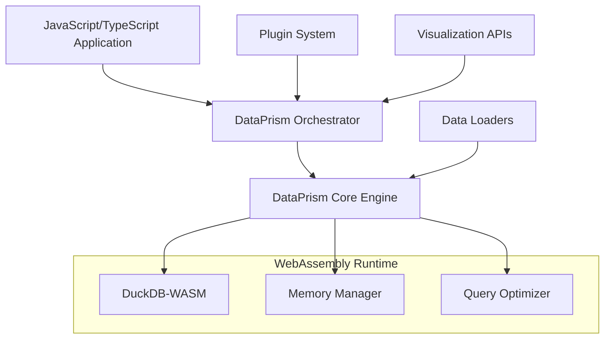

# DataPrism Core

[](https://badge.fury.io/js/@dataprism%2Fcore)
[](https://github.com/dataprism/core/actions)
[](https://github.com/dataprism/core/actions)
[](https://opensource.org/licenses/MIT)

> High-performance browser-based analytics engine powered by WebAssembly and DuckDB

DataPrism Core brings the power of traditional data warehouses directly to your web browser. Built on WebAssembly and DuckDB, it enables you to process millions of rows of data without requiring any server infrastructure.

## ✨ Key Features

- 🚀 **High Performance**: WebAssembly-powered engine processing 1M+ rows in <2 seconds
- 🔒 **Privacy First**: All processing happens locally in your browser
- 🛠️ **Developer Friendly**: Full TypeScript support with comprehensive documentation
- 🌐 **Universal**: Works in any modern browser with zero server dependencies
- 🔌 **Extensible**: Plugin architecture for custom data processors and visualizations
- 📊 **SQL Analytics**: Complete DuckDB SQL support with advanced analytical functions

## 🚀 Quick Start

### Installation

```bash
# NPM (recommended for projects)
npm install @dataprism/core

# Yarn
yarn add @dataprism/core

# CLI (project scaffolding)
npx @dataprism/cli init my-analytics-app
```

### CDN Usage (No Installation Required)

DataPrism is available via CDN for immediate use in any web application:

#### ESM (Recommended)
```html
<script type="module">
  import { DataPrismEngine } from 'https://dataprism.github.io/core/dataprism.min.js';
  
  const engine = new DataPrismEngine();
  await engine.initialize();
  
  // Your analytics code here
</script>
```

#### UMD (Legacy Browser Support)
```html
<script src="https://dataprism.github.io/core/dataprism.umd.js"></script>
<script>
  const engine = new DataPrism.DataPrismEngine();
  engine.initialize().then(() => {
    // Your analytics code here
  });
</script>
```

#### With Subresource Integrity (Recommended)
```html
<script type="module" 
        src="https://dataprism.github.io/core/dataprism.min.js"
        integrity="sha384-HASH_WILL_BE_PROVIDED"
        crossorigin="anonymous">
</script>
```

#### Available CDN Assets

| Asset | Description | Size | Use Case |
|-------|-------------|------|----------|
| `dataprism.min.js` | Complete DataPrism bundle (ESM) | ~800KB | Modern applications |
| `dataprism.umd.js` | UMD bundle for legacy browsers | ~850KB | Legacy support |
| `orchestration.min.js` | High-level APIs only | ~200KB | When using core separately |
| `plugin-framework.min.js` | Plugin system only | ~150KB | Plugin development |
| `assets/*.wasm` | WebAssembly binaries | ~1.2MB | Automatically loaded |
| `plugins/manifest.json` | Available plugins registry | ~10KB | Plugin discovery |

### Basic Usage

```typescript
import { DataPrismEngine } from "@dataprism/core";

// Initialize the engine
const engine = new DataPrismEngine();
await engine.initialize();

// Load CSV data
const csvData = `name,age,city
Alice,25,New York
Bob,30,London
Charlie,35,Tokyo`;

await engine.loadCSV(csvData, "users");

// Execute SQL queries
const result = await engine.query(`
  SELECT city, COUNT(*) as count, AVG(age) as avg_age
  FROM users 
  GROUP BY city
  ORDER BY count DESC
`);

console.log(result.data);
// [
//   { city: 'New York', count: 1, avg_age: 25 },
//   { city: 'London', count: 1, avg_age: 30 },
//   { city: 'Tokyo', count: 1, avg_age: 35 }
// ]
```

## 🏗️ Architecture

DataPrism Core uses a hybrid architecture combining the best of both worlds:



### Components

- **DataPrism Core Engine**: Rust-based WebAssembly module for high-performance computing
- **DuckDB Integration**: Columnar analytics database optimized for OLAP workloads
- **Orchestration Layer**: TypeScript APIs for seamless integration
- **Plugin Framework**: Extensible architecture for custom functionality
- **CLI Tools**: Project scaffolding and development tools

## 📦 Packages

| Package                                              | Description                   | NPM                                                                                                                           |
| ---------------------------------------------------- | ----------------------------- | ----------------------------------------------------------------------------------------------------------------------------- |
| [@dataprism/core](./packages/core)                   | Core WebAssembly engine       | [](https://www.npmjs.com/package/@dataprism/core)                         |
| [@dataprism/orchestration](./packages/orchestration) | High-level orchestration APIs | [](https://www.npmjs.com/package/@dataprism/orchestration)       |
| [@dataprism/plugin-framework](./packages/plugins)    | Plugin development framework  | [](https://www.npmjs.com/package/@dataprism/plugin-framework) |
| [@dataprism/cli](./packages/cli)                     | Command-line interface        | [](https://www.npmjs.com/package/@dataprism/cli)                           |

## 🎯 Performance

DataPrism Core is optimized for real-world analytical workloads:

| Operation          | Dataset Size | Performance | Memory Usage |
| ------------------ | ------------ | ----------- | ------------ |
| CSV Loading        | 1M rows      | ~2 seconds  | ~200MB       |
| Simple Aggregation | 10M rows     | ~500ms      | ~400MB       |
| Complex JOIN       | 1M + 1M rows | ~1 second   | ~300MB       |
| Window Functions   | 5M rows      | ~800ms      | ~350MB       |

_Benchmarks run on Chrome 120+, 16GB RAM, modern desktop_

## 🌐 Browser Support

| Browser | Version | WebAssembly | Threading | Status             |
| ------- | ------- | ----------- | --------- | ------------------ |
| Chrome  | 90+     | ✅          | ✅        | ✅ Fully Supported |
| Firefox | 88+     | ✅          | ✅        | ✅ Fully Supported |
| Safari  | 14+     | ✅          | ❌        | ✅ Supported\*     |
| Edge    | 90+     | ✅          | ✅        | ✅ Fully Supported |

_\*Safari has limited threading support but full functionality_

## 🚀 Live Examples

- **[Interactive Demo](https://demo.dataprism.dev)** - Full-featured analytics application
- **[Query Lab](https://demo.dataprism.dev/query-lab)** - SQL playground with sample datasets
- **[Plugin Showcase](https://demo.dataprism.dev/plugins)** - Explore the plugin ecosystem
- **[Performance Benchmarks](https://demo.dataprism.dev/performance)** - Real-world performance metrics

## 📚 Documentation

- **[Getting Started Guide](https://docs.dataprism.dev/guide/getting-started)** - Your first DataPrism application
- **[API Reference](https://docs.dataprism.dev/api/)** - Complete API documentation
- **[Examples](https://docs.dataprism.dev/examples/)** - Real-world usage examples
- **[Plugin Development](https://docs.dataprism.dev/plugins/)** - Build custom functionality

## 🛠️ Development

### Prerequisites

- Node.js 18+
- Rust (latest stable)
- wasm-pack

### Quick Setup for Demo Analytics

To get the demo analytics app running locally without mocking:

```bash
# Clone the repository
git clone https://github.com/dataprism/core.git
cd DataPrism

# Install root dependencies
npm install

# Build the core packages first
npm run build:packages

# Build and start the demo application
npm run build:demo
npm run dev

# Alternative: Start development server directly
cd apps/demo-analytics
npm install
npm run dev
```

### Full Development Setup

For complete development including all packages:

```bash
# Clone the repository
git clone https://github.com/dataprism/core.git
cd DataPrism

# Install dependencies for all packages
npm install

# Build all packages (includes WASM compilation)
npm run build

# Run tests
npm test

# Start demo application
npm run dev
```

### Package Dependencies

The demo analytics app requires these core packages to be built first:

1. **@dataprism/core** - Rust WASM module (requires `wasm-pack`)
2. **@dataprism/orchestration** - TypeScript orchestration layer
3. **@dataprism/plugins** - Plugin framework

Build order:
```bash
# 1. Core WASM package
npm run build:core

# 2. Orchestration layer  
npm run build:orchestration

# 3. Plugin framework
npm run build:plugins

# 4. Demo app
npm run build:demo
```

### Troubleshooting

#### Demo App Not Working
If the demo app loads but shows errors or doesn't function:

1. **Build the packages first**: The demo app requires the core packages to be built
   ```bash
   npm run build:packages
   ```

2. **Check package linking**: Ensure the demo app can find the local packages
   ```bash
   cd apps/demo-analytics
   npm run type-check
   ```

3. **Use mock mode**: If packages aren't building, you can run in mock mode
   ```bash
   # Edit apps/demo-analytics/src/App.tsx
   # Change: import { DataPrismProvider } from "@contexts/DataPrismContext";
   # To: import { DataPrismProvider } from "@contexts/MockDataPrismContext";
   ```

#### WebAssembly Issues
If you see WASM-related errors:

1. **Install wasm-pack**: `curl https://rustwasm.github.io/wasm-pack/installer/init.sh -sSf | sh`
2. **Check Rust installation**: `rustc --version` (should be 1.70+)
3. **Clear cache and rebuild**: `npm run clean && npm run build:core`

#### Build Failures
Common solutions:
- **Clear node_modules**: `rm -rf node_modules && npm install`
- **Update dependencies**: `npm update`
- **Check Node version**: `node --version` (should be 18+)

### Project Structure

```
dataprism-core/
├── packages/
│   ├── core/              # Rust WASM core
│   ├── orchestration/     # TypeScript orchestration
│   ├── plugins/           # Plugin framework
│   └── cli/               # Command-line tools
├── apps/
│   ├── demo-analytics/    # Demo application
│   └── docs/              # Documentation portal
├── tools/
│   ├── build/             # Build configuration
│   ├── scripts/           # Utility scripts
│   └── release/           # Release automation
└── tests/
    ├── browser/           # Browser tests
    └── performance/       # Performance benchmarks
```

### Available Scripts

```bash
# Development
npm run dev                 # Start demo application
npm run dev:docs           # Start documentation server

# Building
npm run build              # Build all packages
npm run build:cdn          # Build CDN bundles
npm run build:release      # Production build with validation

# Testing
npm test                   # Run all tests
npm run test:browser       # Browser compatibility tests
npm run test:performance   # Performance benchmarks

# Quality
npm run lint               # Lint all code
npm run format             # Format all code
npm run validate           # Run all validations

# CLI
npx @dataprism/cli init my-app    # Create new project
npx @dataprism/cli plugin create  # Create new plugin
```

## 🔧 Configuration

### Engine Configuration

```typescript
const engine = new DataPrismEngine({
  memoryLimit: "512MB", // Memory limit
  queryTimeout: 30000, // Query timeout in ms
  enableOptimizations: true, // Enable query optimizations
  debug: false, // Debug mode
});
```

### Required Headers

For WebAssembly to work properly, ensure your server sends:

```http
Cross-Origin-Embedder-Policy: require-corp
Cross-Origin-Opener-Policy: same-origin
```

## 🔌 Plugin System

Extend DataPrism with custom functionality:

```typescript
import { PluginBase } from "@dataprism/plugin-framework";

class MyPlugin extends PluginBase {
  static metadata = {
    name: "my-plugin",
    version: "1.0.0",
    type: "data-processor",
  };

  async process(data, context) {
    // Custom processing logic
    return processedData;
  }
}
```

Create plugins with the CLI:

```bash
npx @dataprism/cli plugin create my-processor --type data-processor
```

## 🚦 Error Handling

DataPrism provides comprehensive error handling:

```typescript
try {
  const result = await engine.query("SELECT * FROM non_existent_table");
} catch (error) {
  if (error instanceof QueryError) {
    console.error("SQL Error:", error.message);
    console.error("Line:", error.line);
  }
}
```

## 📊 Performance Monitoring

Monitor your application's performance:

```typescript
// Get performance metrics
const metrics = await engine.getMetrics();
console.log("Memory usage:", metrics.memoryUsage);
console.log("Query count:", metrics.queryCount);
console.log("Average query time:", metrics.avgQueryTime);

// Set up real-time monitoring
setInterval(async () => {
  const currentMetrics = await engine.getMetrics();
  updateDashboard(currentMetrics);
}, 5000);
```

## 🔒 Security

DataPrism Core is built with security in mind:

- **Local Processing**: Your data never leaves your browser
- **Integrity Validation**: All WASM binaries include SHA-384 hashes
- **No Network Calls**: Completely offline-capable
- **Sandboxed Execution**: WebAssembly provides additional security layer

## 🌟 Use Cases

### Interactive Dashboards

Build real-time dashboards that process data entirely in the browser:

- Financial reporting and analysis
- Sales performance tracking
- Operational metrics monitoring

### Data Exploration Tools

Create powerful data exploration interfaces:

- Self-service analytics platforms
- Business intelligence tools
- Ad-hoc query interfaces

### Embedded Analytics

Embed analytics directly in your applications:

- SaaS product analytics
- Customer-facing reporting
- White-label analytics solutions

## 🗺️ Roadmap

### v1.1 (Q2 2024)

- [ ] LLM integration for natural language queries
- [ ] Real-time streaming data processing
- [ ] Advanced visualization components
- [ ] Mobile app SDK

### v1.2 (Q3 2024)

- [ ] Machine learning model integration
- [ ] Advanced plugin marketplace
- [ ] Cloud synchronization options
- [ ] Enterprise security features

### v2.0 (Q4 2024)

- [ ] Multi-threaded processing
- [ ] Advanced caching strategies
- [ ] Collaborative analytics features
- [ ] Advanced data connectors

## 🤝 Contributing

We welcome contributions! Please see our [Contributing Guide](./CONTRIBUTING.md) for details.

### Development Workflow

1. Fork the repository
2. Create a feature branch (`git checkout -b feature/amazing-feature`)
3. Make your changes
4. Add tests for new functionality
5. Ensure all tests pass (`npm test`)
6. Commit your changes (`git commit -m 'Add amazing feature'`)
7. Push to the branch (`git push origin feature/amazing-feature`)
8. Open a Pull Request

## 📝 License

This project is licensed under the MIT License - see the [LICENSE](./LICENSE) file for details.

## 🙏 Acknowledgments

- **[DuckDB](https://duckdb.org/)** - High-performance analytical database
- **[WebAssembly](https://webassembly.org/)** - Enabling near-native performance in browsers
- **[Rust](https://www.rust-lang.org/)** - Systems programming language for performance and safety

## 📞 Support

- 📚 **[Documentation](https://docs.dataprism.dev)** - Comprehensive guides and API reference
- 💬 **[GitHub Discussions](https://github.com/dataprism/core/discussions)** - Community support and questions
- 🐛 **[GitHub Issues](https://github.com/dataprism/core/issues)** - Bug reports and feature requests
- 📧 **[Email Support](mailto:support@dataprism.dev)** - Direct support for enterprise users

## 📈 Community

- 🐦 **[Twitter](https://twitter.com/dataprism)** - Updates and announcements
- 📧 **[Newsletter](https://dataprism.dev/newsletter)** - Monthly updates and tips
- 💼 **[LinkedIn](https://linkedin.com/company/dataprism)** - Professional updates

---

<div align="center">

**[Website](https://dataprism.dev) • [Documentation](https://docs.dataprism.dev) • [Demo](https://demo.dataprism.dev) • [GitHub](https://github.com/dataprism/core)**

Made with ❤️ by the DataPrism Team

</div>
